# Wasserstein Adversarial Domain Adaptation Model for Image Recognition

In this respository, we implmented our proposed Wasserstein adversarial domain adaptation (WADA) model for object recognition. Download link for dataset used to evaluate the model can be find in "data description" section.

Our WADA model consists of source extractor, target extractor, task classifier, feature relator, and domain discriminator. Since optimal transport based metric like Wasserstein distance can avoid gradient vanishing caused in $f$-divergence, we apply it in adversarial domain adaptation model to stablize the training process and improve adaptation performance. In addition to traditional benchmark and task, we also apply our model to partial transfer learning issue which combined with regression form of GAN and relevance machenism to decide the weight of each pile during optimizing stage.

# Data Description 
- Digit dataset
    - MNIST
    - MNISTM
    - USPS
- Office dataset
    - Amazon
    - DSLR
    - Webcam  

# Experimental Settings

- Framework
    - Pytorch 0.4.1

- Hardware
    - CPU: Intel Core i7-7700 @3.60 GHz
    - RAM: DDR3 2400MHz 64GB
    - GPU: Geforce GTX 1080Ti 11GB
    - CUDA Version: 9.0.176
    - CuDNN Version: 7.1.1

# Experimental Results

### Data distribution before adaptation trainning

Here blue region represents source domain and red regrion represents target domain 
From left to right are t-SNE embedding plot of MNISTM, USPS, and Office dataset rspectively 

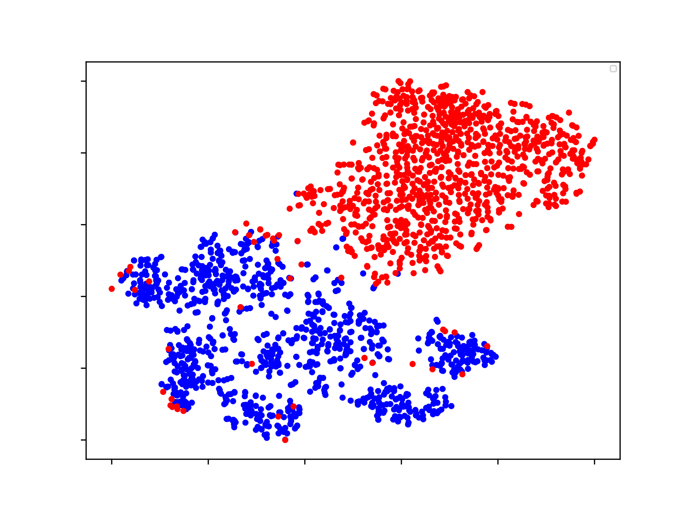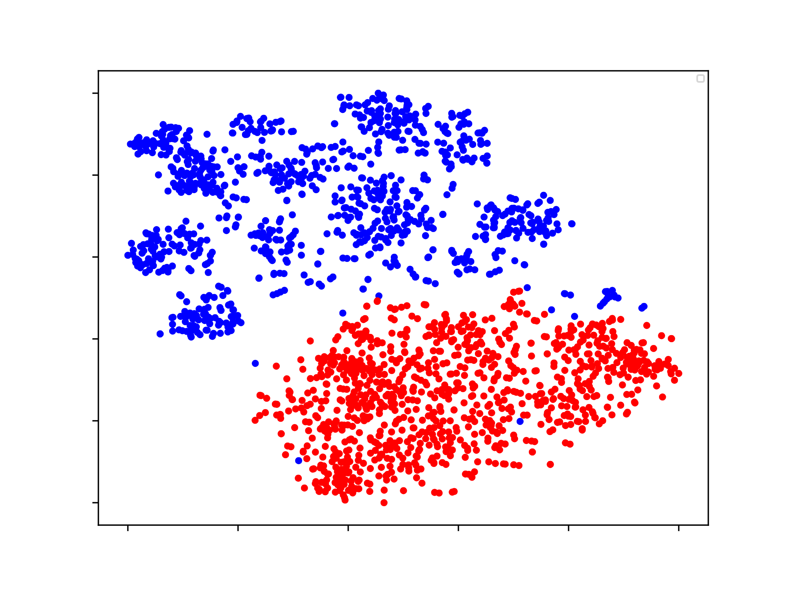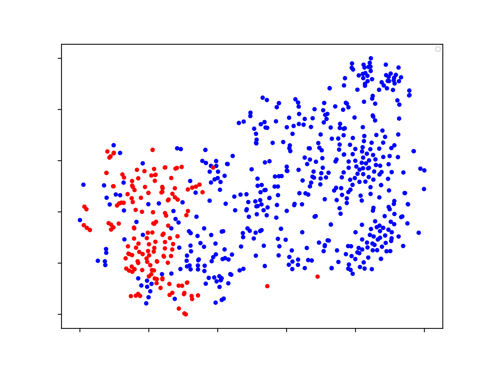  

Following sections are the results of our model under partial and non-partial setting 
To better visualize adaptation performance, we color the t-SNE plot according to domain and class

- left hand side: colored by data domain
- right hand side: colored by data class

### Non partial domain adaptation results
- MNISTM 
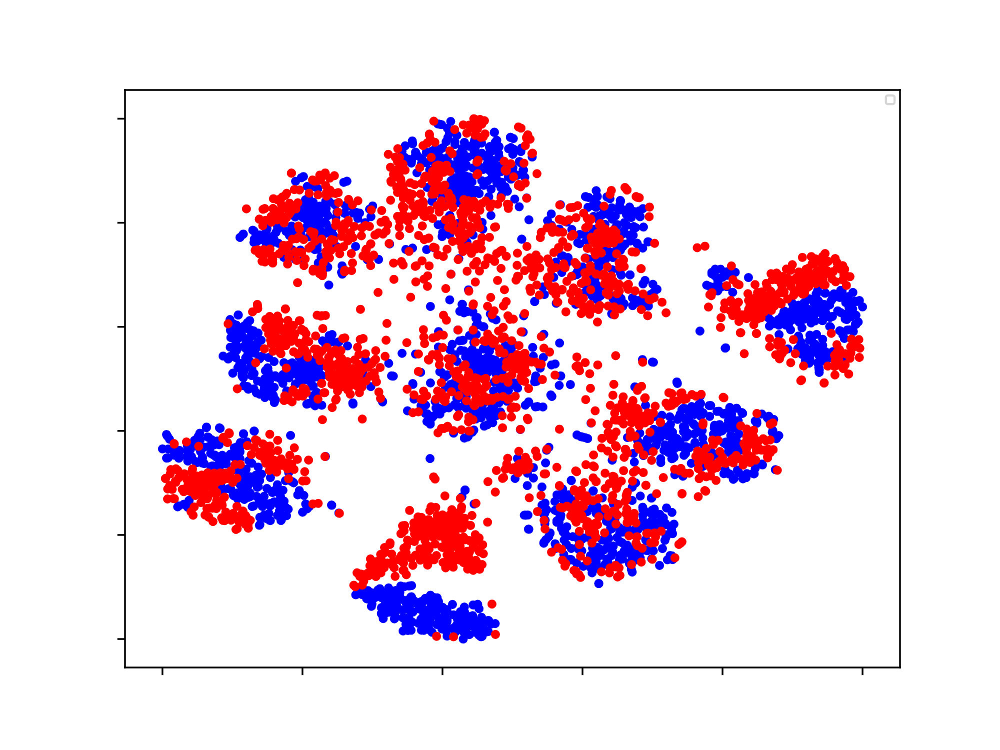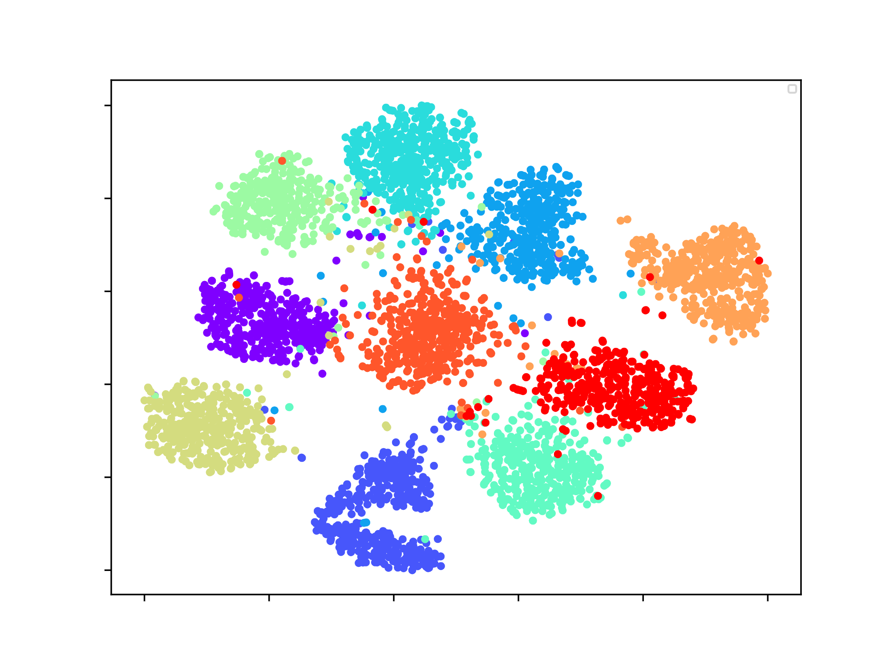 

- USPS 
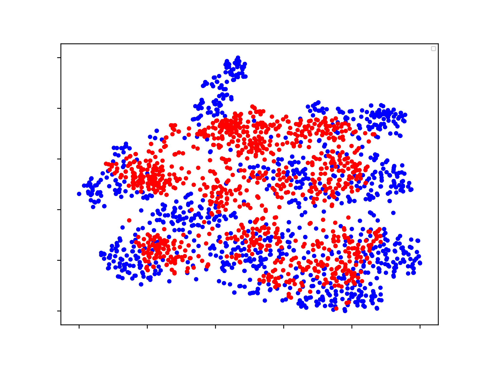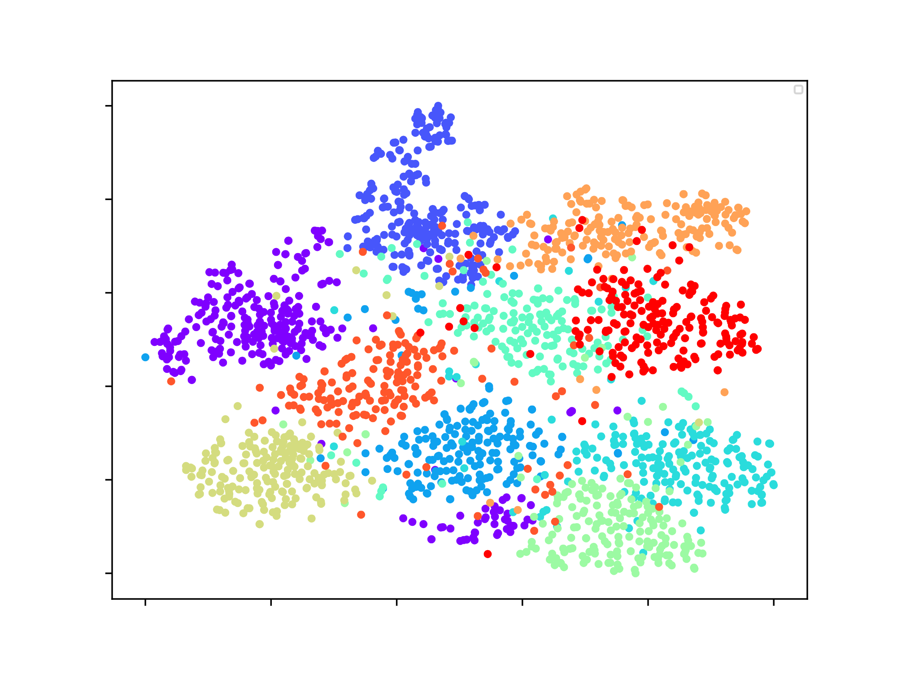 

- Office 
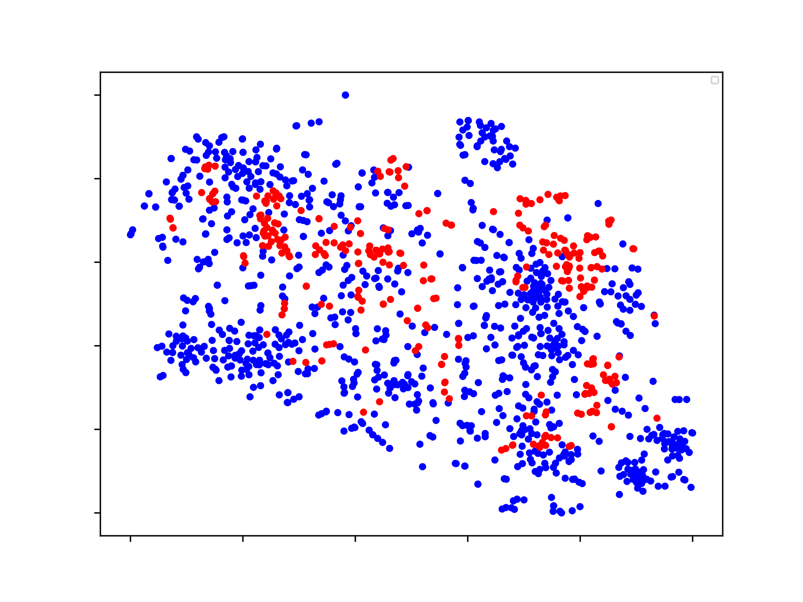 

### Partial domain adaptation results
- MNISTM 
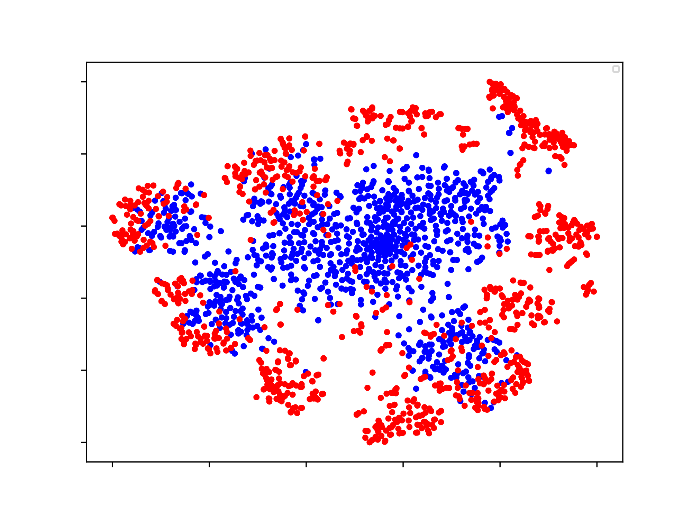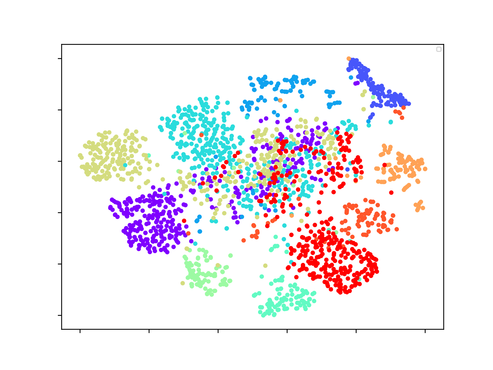 

- USPS 
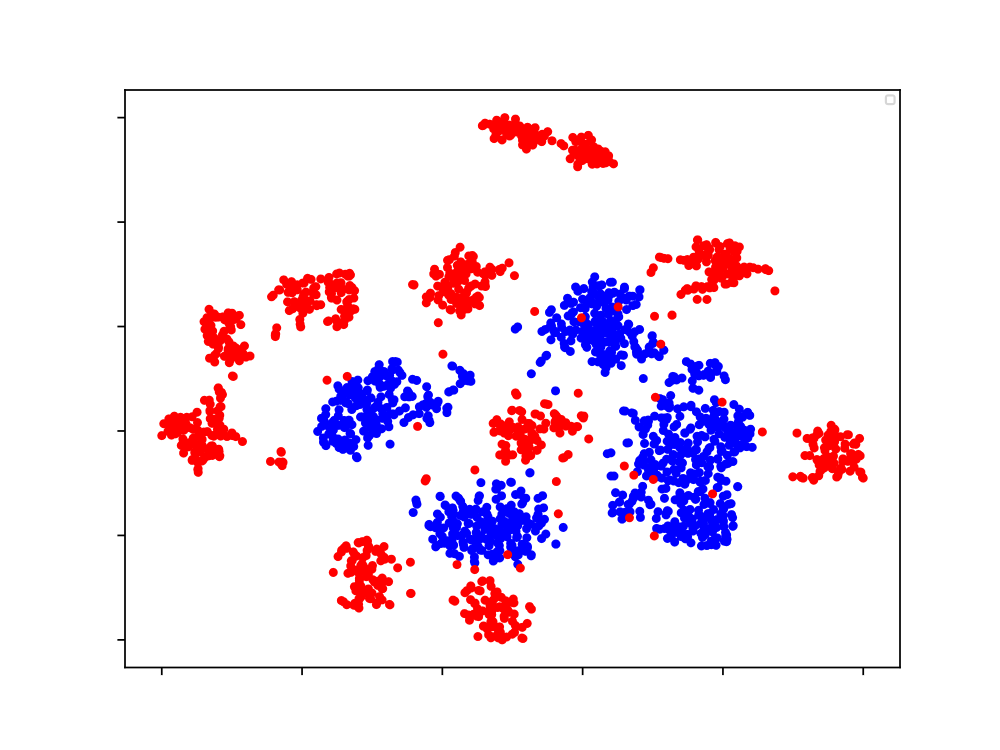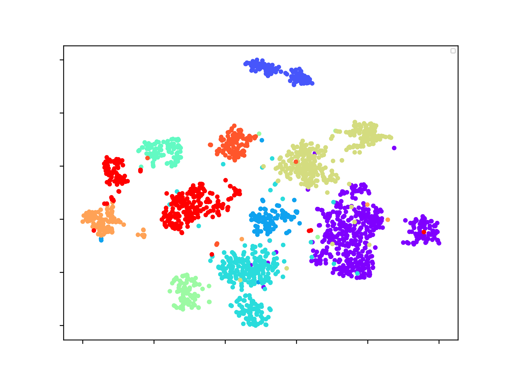 

- Office 
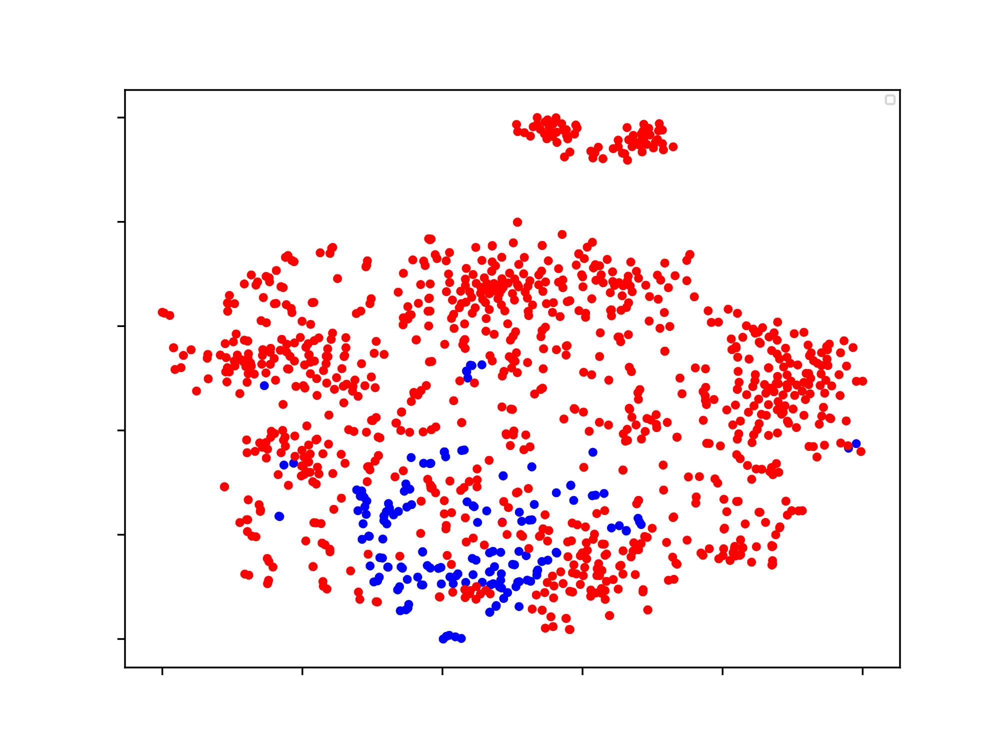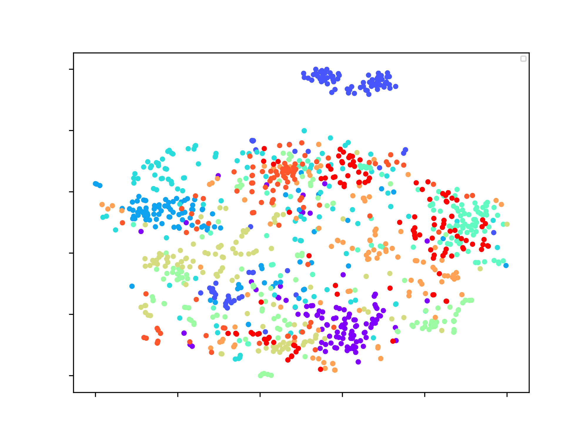 
